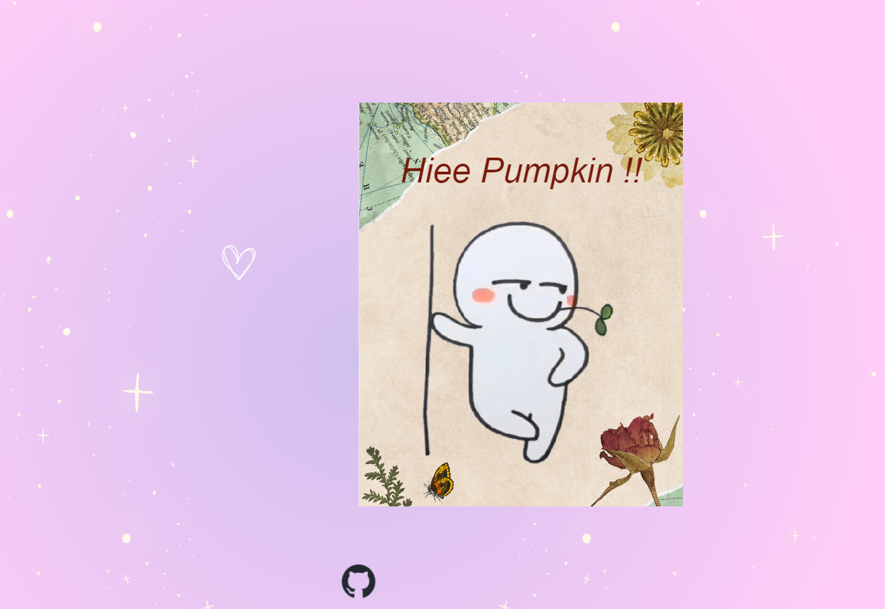

# Project Title: Wanna Date?
This project is a playful and interactive web application that presents a unique dating invitation. The main feature is a digital card that flips open to reveal a message asking the viewer, "Wanna Date?" when hovered over.

## Technologies Used

- HTML
- CSS

## Features

- Interactive card that flips open on hover
- Custom Google Fonts for typography
- Full-page background image for enhanced visual appeal

## How to Use

1. Visit [wannadate.social](http://wannadate.social) or clone the repository to your local machine.
2. If cloned, open the `index.html` file in your web browser.
3. Hover over the card to reveal the message.

## Future Enhancements

- Add more interactivity, such as animations or sound effects.
- Make the card customizable so users can input their own messages.
- Improve responsiveness for better display on various screen sizes.

## License

This project is licensed under the MIT License - see the LICENSE.md file for details.
